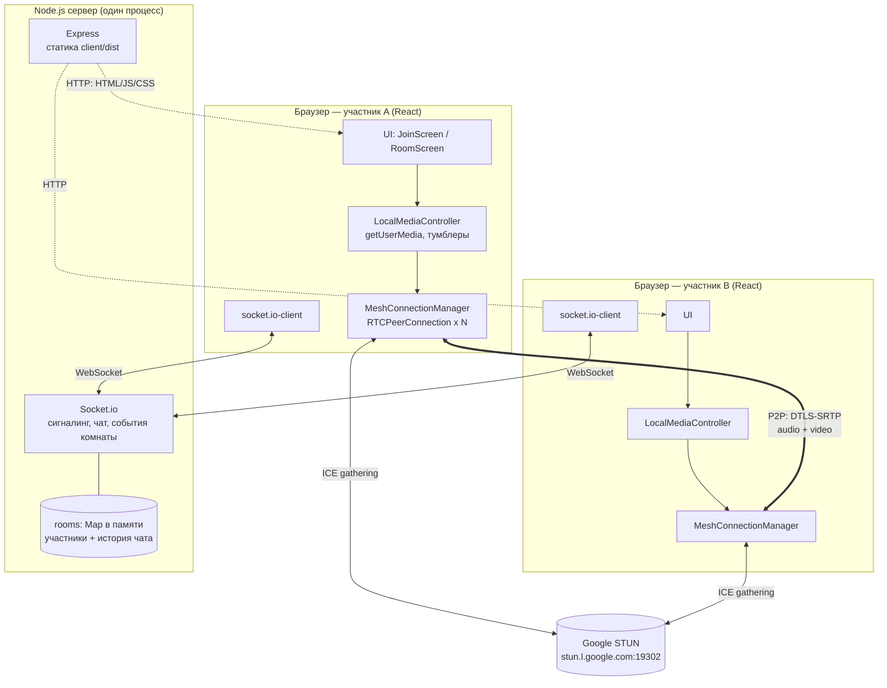
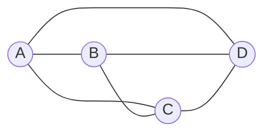
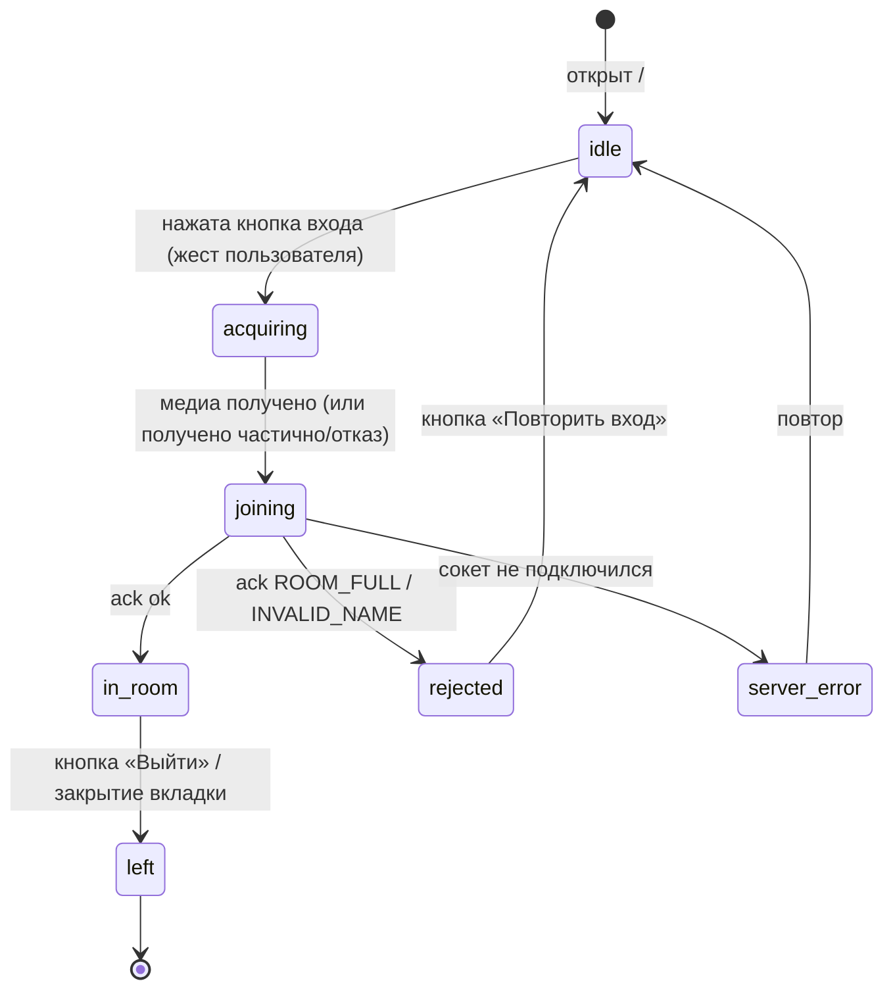
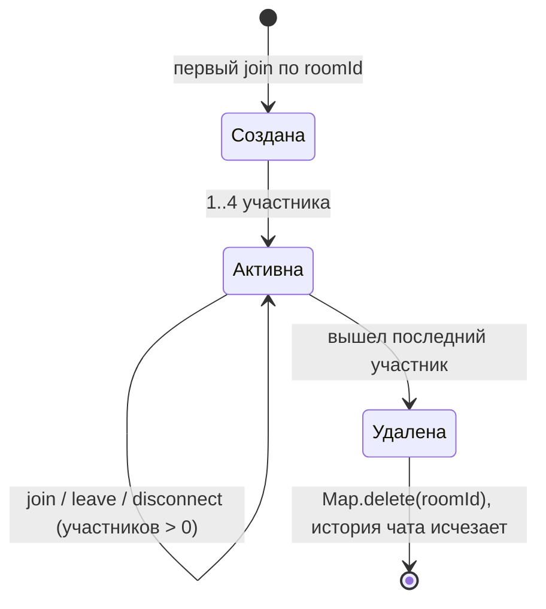
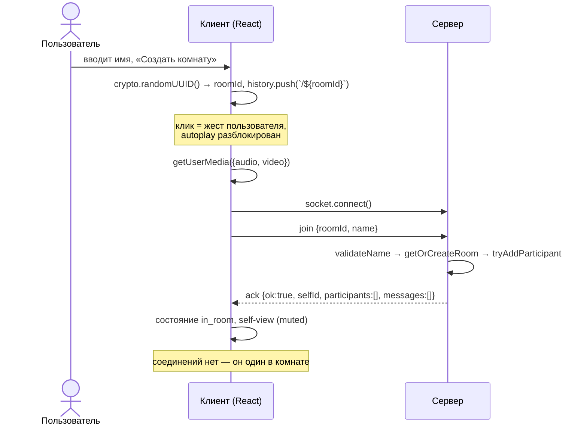
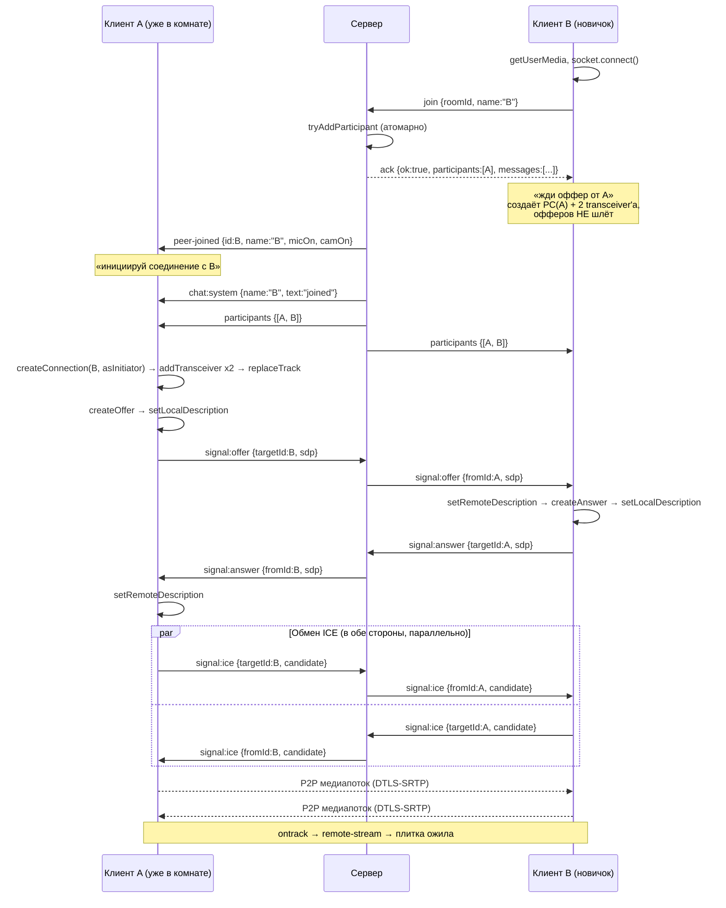
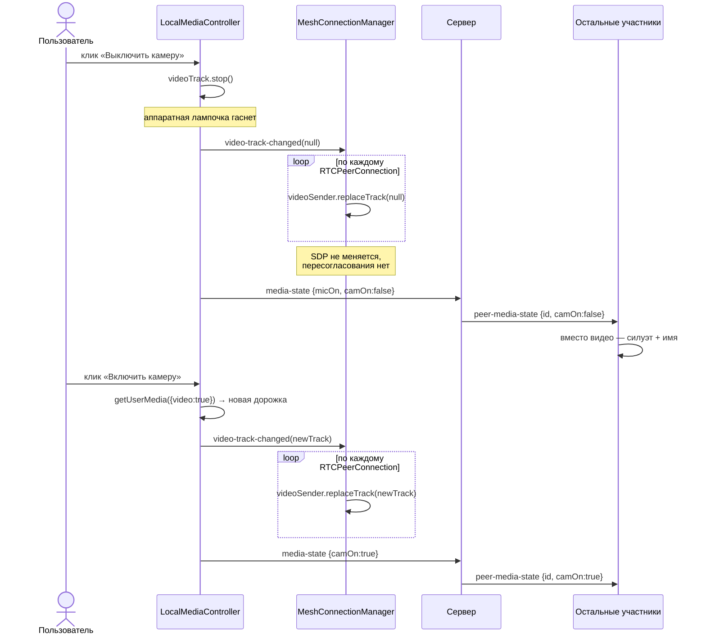
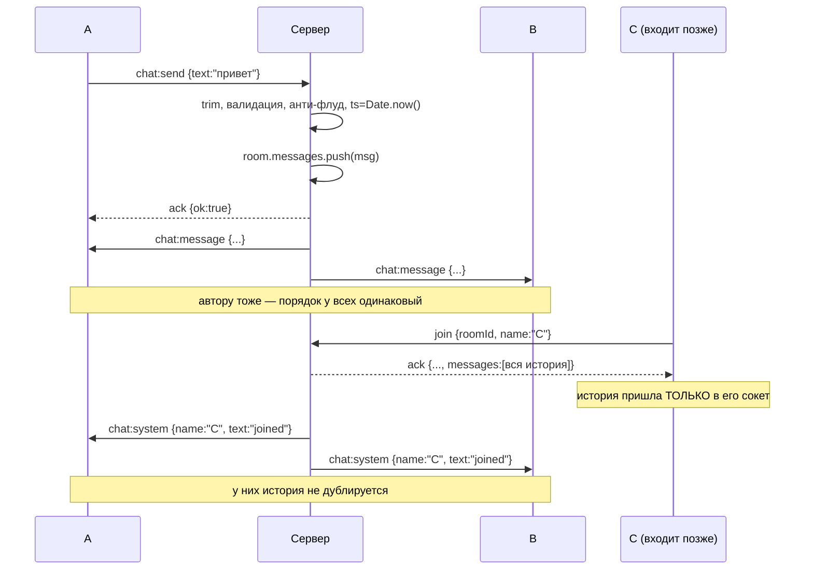
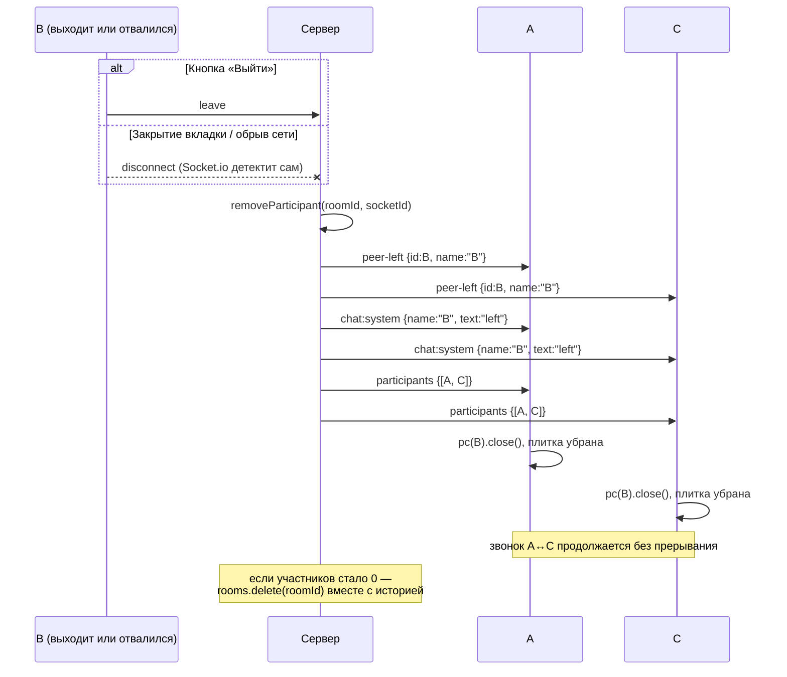

# Technical Design Document — Видеочат-комната (`video-chat-room`)

| | |
|---|---|
| **Документ** | Technical Design Document (TDD) |
| **Версия** | 1.0 |
| **feature-name** | `video-chat-room` |
| **Источник требований** | [`prd-video-chat-room.md`](./prd-video-chat-room.md) (PRD v1.0) |
| **Шаблон** | `rules/prd-design.mdc` |
| **Статус кодовой базы** | Greenfield — репозитория с кодом нет |

---

## 1. Overview / Контекст

### 1.1 Цель

Спроектировать реализацию веб-приложения «Видеочат-комната»: групповой аудио-видеозвонок **до 4 участников** в одной комнате с общим текстовым чатом, без регистрации, без базы данных и без сохранения состояния на клиенте. Вход — по ссылке вида `/<roomId>`, представление — по отображаемому имени.

Документ отвечает на вопрос **«как строим»** и является достаточным основанием, чтобы разработчик сразу начал писать код. Что и зачем — в PRD.

### 1.2 Объём

Покрываются все функциональные требования PRD (пункты 1–40 раздела 4) и пользовательские истории US-1 … US-13.

### 1.3 Жёсткие ограничения (входные, обсуждению не подлежат)

| # | Ограничение | Источник |
|---|---|---|
| C-1 | Стек: Node.js + Express + Socket.io (сервер), React (клиент), **чистый WebRTC** | PRD §7, тест-задание §6.1 |
| C-2 | Топология медиа — **mesh (P2P каждый-с-каждым)**, без SFU/MCU | PRD §7 |
| C-3 | Запрещены обёртки над WebRTC: LiveKit, mediasoup, PeerJS, simple-peer и аналоги. Только `RTCPeerConnection` напрямую | Фиксированное решение |
| C-4 | ICE: только публичные Google STUN. TURN не используется | PRD §7, Non-Goals |
| C-5 | Никакой БД и персистентного хранилища. Всё состояние — в памяти процесса | PRD §7 |
| C-6 | Никакого `localStorage` / `sessionStorage` / cookie-состояния на клиенте | PRD §5 |
| C-7 | Лимит 4 участника на комнату, проверка атомарна на сервере | PRD §4 п.7 |
| C-8 | Ничего из PRD §5 (Non-Goals) не реализуется | PRD §5 |
| C-9 | Язык интерфейса — русский, без i18n. Десктоп от 1024px | PRD §5, §6 |

### 1.4 Нефункциональные ориентиры

- Задержка медиа в локальной сети ≤ 500 мс (PRD п. US-6).
- Браузеры: Chrome / Firefox / Edge 100+.
- `getUserMedia` требует защищённого контекста: HTTPS либо `localhost`.

### 1.5 Сознательное расхождение с референс-демо

Демо `chat.forasoft.com` построено на LiveKit (SFU). Здесь намеренно реализуется mesh на голом WebRTC — это требование тест-задания. Демо используется как референс по фичам и UX, но не по архитектуре медиаслоя. Следствие — лимит в 4 участника (см. §9.1).

---

## 2. Current Architecture & Codebase Summary

### 2.1 Честная констатация

**Существующего кода нет.** Это greenfield-проект: репозиторий пуст, кодовая база создаётся с нуля в рамках этой фичи. Ни сервисов, ни контроллеров, ни схем БД, ни тестов для анализа не существует. Раздел «сводка просмотренных файлов кода» в его обычном виде неприменим.

Следствия для дизайна:

- Нет легаси-ограничений: структура каталогов, конвенции именования и границы модулей выбираются в этом документе (§4).
- Нет миграций и обратной совместимости: раздел 12 описывает первичную установку, а не миграционный план (§12.3).
- Нет существующих тестов: стратегия тестирования (§11) описывает создание с нуля.

### 2.2 Просмотренные материалы (вместо обзора кода)

| Путь | Что это | Ключевое для дизайна |
|---|---|---|
| `prds/video-chat-room/prd-video-chat-room.md` | PRD v1.0 | 40 функциональных требований, 13 US с Gherkin-критериями, Non-Goals, зафиксированный стек и топология mesh |
| `rules/prd-design.mdc` | Правило генерации TDD | Обязательная структура из 14 разделов, запрет на production-код внутри TDD |
| `rules/prd-tasks.mdc` | Правило генерации плана задач | Формат Implementation Plan, требование трассируемости на ID PRD и разделы TDD (вход для этапа 2) |

### 2.3 Целевая структура репозитория (создаётся с нуля)

```text
fora-video-chat/
├── package.json              # корень: npm workspaces + скрипты dev/build/start
├── .gitignore                # node_modules, .env, build, dist
├── README.md                 # пишется последней задачей
├── prds/video-chat-room/     # PRD, TDD, Implementation Plan — часть сдачи
├── rules/
├── server/
│   ├── package.json
│   └── src/
│       ├── index.js              # точка входа: express + http + socket.io
│       ├── config.js             # PORT, лимиты, константы
│       ├── rooms.js              # in-memory store комнат (чистые функции + Map)
│       ├── validation.js         # валидация имени и текста сообщения
│       └── socket/
│           ├── events.js         # константы имён событий (общий словарь)
│           └── handlers.js       # регистрация обработчиков на сокет
└── client/
    ├── package.json
    ├── vite.config.js            # dev-proxy на сервер
    ├── index.html
    └── src/
        ├── main.jsx
        ├── App.jsx                       # роутинг: / и /:roomId
        ├── config.js                     # ICE_SERVERS, лимиты UI
        ├── lib/
        │   ├── socket.js                 # создание/жизненный цикл socket.io-клиента
        │   ├── events.js                 # зеркало server/src/socket/events.js
        │   ├── LocalMediaController.js   # getUserMedia, тумблеры камеры/микрофона
        │   └── MeshConnectionManager.js  # набор RTCPeerConnection, сигналинг, ICE
        ├── hooks/
        │   ├── useRoomSession.js         # оркестрация: сокет + медиа + mesh + состояние
        │   └── useAutoScroll.js
        └── components/
            ├── JoinScreen.jsx
            ├── RoomScreen.jsx
            ├── VideoGrid.jsx
            ├── VideoTile.jsx
            ├── ControlBar.jsx
            ├── ChatPanel.jsx
            ├── ParticipantList.jsx
            └── Notice.jsx                # сообщения об ошибках/состояниях
```

**Обоснование выбора инструментов сборки.** Vite для клиента — быстрый dev-сервер с HMR и проксированием на Node-сервер; в проде отдаём статический `client/dist` тем же Express, чтобы приложение поднималось одной командой и жило на одном origin (нет CORS, нет отдельного хоста для сокета). npm workspaces — чтобы `npm install` в корне ставил зависимости обоих пакетов. Ни то, ни другое не меняет обязательный стек.

**Язык кода** — JavaScript ES6+ без TypeScript: этого требует формулировка стека, а контракты событий фиксируются в §6 и в общем модуле `events.js`.

---

## 3. Proposed Architecture / High-Level Design

### 3.1 Общая схема



Ключевое разделение: **через сервер не проходит ни один медиабайт**. Сервер — это (1) раздача статики, (2) реле сигналинга, (3) единственный источник правды о составе комнаты и истории чата. Медиа идёт напрямую между браузерами.

### 3.2 Mesh при 4 участниках



N·(N−1)/2 = 6 соединений на комнату; каждый клиент держит 3 `RTCPeerConnection` и отдаёт 3 копии своего потока. Это прямая причина лимита в 4 (см. §9.1).

### 3.3 Архитектурные принципы

1. **Сервер — авторитет по составу комнаты, клиент — авторитет по своему медиа.** Список участников, их `micOn/camOn` и история чата хранятся на сервере и рассылаются оттуда; клиент не «домысливает» состав по факту прихода WebRTC-потоков.
2. **Сигналинг тупой, клиент умный.** Сервер не парсит SDP и не хранит состояние ICE — он перекладывает конверт от `fromId` к `targetId`, предварительно проверив, что оба в одной комнате.
3. **Детерминированная роль в согласовании.** Роль «кто шлёт оффер» назначается сервером, а не выводится клиентами (см. §3.4).
4. **Отсутствие persistence — осознанная часть контракта.** Перезапуск процесса = все комнаты исчезли. Это допустимо и документируется в README.
5. **Один процесс, без горизонтального масштабирования.** Никакого Redis-адаптера и sticky-sessions: вне объёма (§9.4).

### 3.4 Решение по инициатору соединения (защита от glare)

**Правило: оффер шлёт тот, кто уже был в комнате. Новичок только отвечает.**

Механика:

- При успешном `join` сервер шлёт **уже находящимся** участникам событие `peer-joined` — для них это команда «инициируй соединение с этим id».
- **Новичку** сервер в ack-ответе отдаёт список текущих участников, но с семантикой «от этих жди оффер». Сам он офферы не создаёт.

Почему так, а не «оба создают оффер и разрулим»: одновременные офферы дают **glare** — оба пира оказываются в `have-local-offer`, `setRemoteDescription(offer)` падает с `InvalidStateError`, соединение разваливается. Классические лекарства — perfect negotiation с ролями polite/impolite или сравнение id — работают, но требуют аккуратной обработки отката (`rollback`), который в Firefox и Chrome исторически вёл себя по-разному. Назначение роли сервером убирает саму возможность гонки: при входе N-го участника поднимается ровно N−1 соединений, и в каждом ровно одна сторона — инициатор.

Запасное правило на случай, если понадобится симметрия (например, при будущем ICE-restart): инициатор — тот, чей `socket.id` меньше при строковом сравнении. Детерминированность важнее конкретного правила.

### 3.5 Решение по управлению камерой и микрофоном (главное требование задания)

PRD п. 19 и US-7 требуют, чтобы при выключении камеры **гасла аппаратная лампочка**. Это означает, что дорожку нужно именно **остановить**, а не заглушить.

| | Камера | Микрофон |
|---|---|---|
| Выключение | `track.stop()` + `sender.replaceTrack(null)` на каждом PC | `track.enabled = false` |
| Включение | новый `getUserMedia({video:true})` + `sender.replaceTrack(newTrack)` | `track.enabled = true` |
| Пересогласование SDP | **не требуется** | не требуется |
| Аппаратный индикатор | гаснет | остаётся (не требуется гасить) |
| Задержка переключения | ~100–400 мс (повторный `getUserMedia`) | мгновенно |

**Почему `replaceTrack`, а не `removeTrack` + `addTrack`.** `removeTrack`/`addTrack` меняют набор m-секций и запускают `negotiationneeded` → новый оффер/ответ через сигналинг на **каждом** из трёх соединений. Это и лишний round-trip, и три новых окна для гонки согласования (особенно если в этот же момент кто-то входит в комнату). `replaceTrack` подменяет источник внутри уже согласованного transceiver'а — SDP не меняется, сигналинг не трогается, гонки не возникает.

**Почему `track.enabled = false` не подходит для камеры.** Дорожка остаётся живой и удерживает устройство: лампочка горит, и пользователь справедливо считает, что его снимают. Формально требование «видеодорожка освобождается, камера физически перестаёт использоваться» не выполняется.

**Почему для микрофона выбрана обратная стратегия — намеренная асимметрия.** Требования гасить индикатор микрофона в PRD нет, а цена симметричного решения высока: каждое включение микрофона — это новый `getUserMedia`, то есть 100–400 мс задержки и риск, что устройство в этот момент занято другим приложением и вернётся ошибка. Микрофоном в звонке щёлкают в разы чаще, чем камерой («сейчас скажу» / «опять залаяла собака»), и задержка на mute-кнопке ощущается как поломка. `track.enabled = false` даёт мгновенное и безотказное переключение при том же наблюдаемом эффекте для собеседников: аудиодорожка продолжает передаваться, но состоит из тишины. Разная цена ошибки → разные механизмы.

**Необходимое следствие: transceiver'ы создаются заранее.** Если участник вошёл с выключенной (или отсутствующей) камерой, то в момент создания `RTCPeerConnection` видеодорожки нет, `addTrack` вызывать нечем, sender'а не существует — и позднее включение камеры некуда «подложить» через `replaceTrack`. Поэтому при создании каждого соединения сразу резервируются обе m-секции:

```js
// ключевой приём: sender существует всегда, даже когда дорожки нет
const audioTx = pc.addTransceiver('audio', { direction: 'sendrecv' });
const videoTx = pc.addTransceiver('video', { direction: 'sendrecv' });
if (localAudioTrack) audioTx.sender.replaceTrack(localAudioTrack);
if (localVideoTrack) videoTx.sender.replaceTrack(localVideoTrack);
```

Дальше любое включение/выключение камеры — это `replaceTrack(track | null)` по всем соединениям, без единого пересогласования, в любом состоянии сессии.

---

## 4. Components & Interfaces

### 4.1 Серверные модули

#### `server/src/config.js`

Константы в одном месте: `PORT` (по умолчанию 3001), `MAX_PARTICIPANTS = 4`, `MAX_NAME_LENGTH = 30`, `MAX_MESSAGE_LENGTH = 1000`, параметры анти-флуда.

#### `server/src/rooms.js` — хранилище состояния

Ответственность: единственное место, где живёт и мутируется состояние комнат. Наружу — синхронные функции без `await` внутри (критично для §4.3 и §8.2).

| Функция | Сигнатура | Назначение |
|---|---|---|
| `getOrCreateRoom` | `(roomId) → Room` | Возвращает комнату, создавая при отсутствии. Отдельного состояния «комната не найдена» не существует (PRD п.5) |
| `tryAddParticipant` | `(roomId, socketId, name) → {ok:true, room} \| {ok:false, reason:'ROOM_FULL'}` | **Атомарная** проверка лимита и вставка в одном синхронном блоке |
| `removeParticipant` | `(roomId, socketId) → {removed, roomDeleted}` | Удаляет участника; при опустевании удаляет комнату целиком вместе с историей |
| `setMediaState` | `(roomId, socketId, {micOn, camOn}) → participant \| null` | Обновляет флаги устройств |
| `addMessage` | `(roomId, message) → message \| null` | Кладёт сообщение (пользовательское или системное) в историю комнаты |
| `getParticipants` | `(roomId) → Participant[]` | Список для рассылки |
| `getMessages` | `(roomId) → Message[]` | История для новичка |
| `hasParticipant` | `(roomId, socketId) → boolean` | Проверка при реле сигналинга |

Модуль **не знает про Socket.io** — только структуры данных. Это делает его полностью юнит-тестируемым без поднятия сервера (§11.1).

#### `server/src/validation.js`

| Функция | Назначение |
|---|---|
| `validateName(raw)` | `trim` → проверка непустоты, длины ≤ 30, разрешённого алфавита. Возвращает `{ok, value}` либо `{ok:false, code}` |
| `validateMessage(raw)` | `trim` → непустота, длина ≤ 1000 |
| `validateRoomId(raw)` | Формат id (см. §5.4), защита от мусорных ключей в `Map` |

Серверная валидация обязательна и не заменяется клиентской: клиентские проверки обходятся из консоли за десять секунд (PRD п. 38).

#### `server/src/socket/events.js`

Константы имён событий, чтобы опечатка ловилась на этапе импорта, а не молчаливым «событие не пришло». Файл дословно дублируется в `client/src/lib/events.js` — единственный разрешённый дубль, он же играет роль контракта.

#### `server/src/socket/handlers.js`

`registerHandlers(io, socket)` — регистрирует обработчики `join`, `signal:*`, `media-state`, `chat:send`, `leave`, `disconnect`. Держит на сокете привязку `socket.data = { roomId, name }`, чтобы при `disconnect` знать, откуда удалять участника, не перебирая все комнаты.

#### `server/src/index.js`

Express: раздача `client/dist` в проде, `GET /healthz` для проверки живости, SPA-fallback (любой неизвестный путь → `index.html`, иначе прямой заход по `/<roomId>` даст 404). HTTP-сервер + `new Server(httpServer)` от Socket.io.

### 4.2 Клиентские модули

#### `LocalMediaController`

Ответственность: всё, что касается локальных устройств. Не знает про сокет и про пиров — отдаёт наружу события.

```js
class LocalMediaController {
  async init()                  // getUserMedia({audio:true, video:true}) с деградацией (§8.3)
  get stream()                  // MediaStream для self-view (в UI монтируется muted)
  get state()                   // {micOn, camOn, hasMic, hasCam, error}
  toggleMic()                   // track.enabled = !enabled  → синхронно
  async toggleCam()             // выкл: track.stop(); вкл: новый getUserMedia
  stopAll()                     // при выходе из комнаты: остановить все дорожки
  on('video-track-changed', cb) // подписка для MeshConnectionManager
  on('state-changed', cb)       // подписка для UI и для отправки media-state на сервер
}
```

Ключевой инвариант: `stream` — один и тот же объект `MediaStream` на всю сессию; при смене видеодорожки старая удаляется через `removeTrack`, новая добавляется через `addTrack`, а React-компонент переприсваивает `srcObject`, чтобы гарантированно перерисовать `<video>`.

#### `MeshConnectionManager`

Ответственность: набор `RTCPeerConnection` по одному на удалённого участника, весь обмен SDP/ICE, применение локальных дорожек ко всем соединениям.

```js
class MeshConnectionManager {
  constructor({ socket, iceServers, getLocalTracks })
  createConnection(peerId, { asInitiator })  // создаёт PC + два transceiver'а
  handleOffer(fromId, sdp)                   // setRemote → createAnswer → emit answer
  handleAnswer(fromId, sdp)                  // setRemote
  handleIce(fromId, candidate)               // с очередью (§4.4)
  replaceVideoTrack(track | null)            // на всех соединениях
  closeConnection(peerId)                    // pc.close() + очистка
  closeAll()
  on('remote-stream', cb)                    // (peerId, MediaStream) → в UI
  on('connection-failed', cb)                // (peerId) → плашка на плитке (§8.5)
}
```

#### `useRoomSession` (хук-оркестратор)

Единственное место, где сходятся сокет, медиа и mesh. Держит состояние сессии как явный конечный автомат:



Важно, что `acquiring` наступает **после** клика: клик по кнопке входа — это и есть жест пользователя, снимающий autoplay-блокировку (§8.7).

#### React-компоненты

| Компонент | Ответственность | Требования PRD |
|---|---|---|
| `JoinScreen` | Поле имени (`maxLength=30`), кнопка «Создать комнату» / «Войти», подсказки валидации | F-01, US-1 |
| `RoomScreen` | Каркас экрана: сетка + панель управления + чат/участники, плашка приглашения | US-6 |
| `VideoGrid` | Раскладка 1/2/3-4 плиток (CSS Grid) | F-07 |
| `VideoTile` | `<video>`, оверлей с именем, иконка перечёркнутого микрофона, заглушка-силуэт, плашка ошибки ICE | F-08, п.16, п.18 |
| `ControlBar` | Микрофон, камера, копирование ссылки, выход | F-09, F-10, F-03, F-17 |
| `ChatPanel` | История, ввод, отправка, автопрокрутка, время HH:MM | F-12…F-15 |
| `ParticipantList` | Актуальный состав комнаты | F-16 |
| `Notice` | «Комната заполнена», отказ в доступе к устройствам, сервер недоступен, нет поддержки WebRTC | US-5, US-12, US-13 |

### 4.3 Инвариант атомарности при входе

```js
// server/src/rooms.js — между проверкой и вставкой НЕТ ни одного await
function tryAddParticipant(roomId, socketId, name) {
  const room = getOrCreateRoom(roomId);
  if (room.participants.size >= MAX_PARTICIPANTS) {
    return { ok: false, reason: 'ROOM_FULL' };   // пятому — отказ
  }
  room.participants.set(socketId, { name, micOn: true, camOn: true });
  return { ok: true, room };
}
```

Node.js исполняет JavaScript в одном потоке: пока синхронный блок не завершён, цикл событий не отдаёт управление другому обработчику `join`. Значит проверка и вставка неделимы, и никакие мьютексы, семафоры или CAS не нужны. **Единственное условие — отсутствие `await` между чтением `size` и `set`**: любой `await` возвращает управление в цикл событий, и второй клиент успевает влезть между проверкой и вставкой, после чего в комнате оказывается 5 участников. Это ровно сценарий «Одновременная гонка за последний слот» из US-5, и защита от него — дисциплина написания одной функции, а не инфраструктура.

### 4.4 Очередь ICE-кандидатов

ICE-кандидаты по сигналингу нередко приходят раньше, чем применён `setRemoteDescription` (особенно на быстром локальном сервере). `addIceCandidate` в этот момент бросает исключение. Решение — буфер на каждое соединение:

```js
if (!pc.remoteDescription) {
  pendingCandidates.get(peerId).push(candidate);   // копим
} else {
  await pc.addIceCandidate(candidate);
}
// после успешного setRemoteDescription — слить накопленное и очистить буфер
```

---

## 5. Data Model & DB Changes

### 5.1 Базы данных нет

Персистентного хранилища не существует и не появится: PRD §7 и Non-Goals прямо это запрещают. Соответственно **нет таблиц, нет индексов, нет DDL и нет миграций**. Этот раздел описывает единственную структуру данных — состояние в оперативной памяти процесса.

### 5.2 Модель состояния сервера

```js
// Единственный источник правды. Живёт в модуле rooms.js.
const rooms = new Map(); // roomId → Room

/**
 * Room {
 *   participants: Map<socketId, Participant>
 *   messages:     Message[]
 * }
 *
 * Participant {
 *   name:   string   // 1..30 символов, прошло серверную валидацию
 *   micOn:  boolean  // по умолчанию true
 *   camOn:  boolean  // по умолчанию true
 * }
 *
 * Message {
 *   type:     'user' | 'system'
 *   authorId: string | null   // socketId автора; null для системных
 *   name:     string          // имя автора / имя участника события
 *   text:     string          // для system: 'joined' | 'left' (см. ниже)
 *   ts:       number          // Date.now() на сервере, миллисекунды
 * }
 */
```

**Почему `Map`, а не объект.** Ключ — `socket.id` (произвольная строка от клиента в случае `roomId`), а у обычного объекта есть прототипные ключи (`__proto__`, `constructor`), которые дают либо prototype pollution, либо ложные попадания при проверке существования. `Map` от этого свободна и даёт честный `size` за O(1) — как раз для проверки лимита.

**Расширение относительно исходной формулировки структуры.** Зафиксированная схема сообщения — `{authorId, name, text, ts}`. К ней добавлено поле `type`. Обоснование: системные события входа и выхода (F-15) должны попадать в ту же ленту, что и обычные сообщения, чтобы новичок видел корректный **хронологический** порядок истории (F-14), но рендерятся они иначе (без автора, курсивом, по центру). Держать их во втором массиве — значит при отдаче истории мержить два массива по `ts`, то есть решать ту же задачу дороже. Различение по `authorId === null` работало бы, но `type` явнее и не ломается, если в будущем появится системное сообщение с автором. Остальные поля не изменены.

**Формулировка системных сообщений.** В истории хранится семантический код (`'joined'` / `'left'`), текст собирается на клиенте: «<Имя> присоединился к комнате» / «<Имя> покинул комнату». Формулировка «соединение потеряно» **не используется нигде** — PRD п. 31 её прямо запрещает, потому что сервер не может достоверно отличить обрыв связи от закрытия вкладки.

### 5.3 Жизненный цикл комнаты



- Комната создаётся **первым участником**, в том числе при входе по неизвестному id из URL. Состояния «комната не найдена» не существует (PRD п.5, US-4).
- При падении числа участников до нуля комната удаляется **целиком**: участники, история сообщений, любые связанные таймеры. Повторный вход по тому же id создаёт новую пустую комнату (PRD п.9, US-10).
- Утечка памяти невозможна по построению: нет ни одного пути, на котором опустевшая комната остаётся в `Map` (проверяется тестом §11.1).

### 5.4 Идентификаторы

| Сущность | Генерация | Где | Видимость в UI |
|---|---|---|---|
| `roomId` | `crypto.randomUUID()` | Клиент, при нажатии «Создать комнату» | Да — это часть ссылки-приглашения |
| `socketId` | Socket.io | Сервер | **Нет, никогда** |
| `messageId` | `crypto.randomUUID()` | Сервер | Нет, только React `key` |

**Почему `roomId` генерируется на клиенте.** Любой URL создаёт или открывает комнату (PRD п.5), поэтому серверный round-trip «создай мне комнату» ничего не проверяет и не резервирует — он был бы чистой церемонией. `crypto.randomUUID()` доступен в целевых браузерах в защищённом контексте (а он у нас обязателен из-за `getUserMedia`), даёт 122 бита энтропии и криптостойкий источник.

**Почему полный UUID, а не короткий читаемый код.** Короткий id (6–8 символов) красивее в ссылке, но повышает шанс, что посторонний **угадает** идентификатор и попадёт в чужой звонок. PRD такое поведение признаёт штатным (п.6) — авторизации нет — но это не повод облегчать задачу: длинный неугадываемый id остаётся единственным практическим барьером приватности.

**Валидация `roomId` на сервере.** Принимается строка длиной ≤ 64 символов из алфавита `[A-Za-z0-9_-]`. Это не про безопасность комнаты, а про гигиену ключей `Map`: без ограничения клиент может засорить память гигантскими ключами.

### 5.5 Данные на клиенте

Никаких. `localStorage`, `sessionStorage`, IndexedDB и cookie-состояние **не используются** (PRD §5). Имя между перезагрузками не запоминается: перезагрузка страницы — это новый вход с повторным вводом имени (PRD п.28). Всё состояние клиента живёт в памяти React-приложения и умирает вместе со вкладкой.

---

## 6. API / Contracts

### 6.1 HTTP

Публичного REST API нет — вся динамика идёт по WebSocket.

| Метод | Путь | Ответ | Назначение |
|---|---|---|---|
| `GET` | `/` | `index.html` | Стартовый экран |
| `GET` | `/<roomId>` | `index.html` | SPA-fallback: роутинг разбирает клиент |
| `GET` | `/assets/*` | статика | Бандл клиента (прод) |
| `GET` | `/healthz` | `200 {"status":"ok"}` | Проверка живости процесса |

### 6.2 Socket.io: общие правила

- Транспорт: WebSocket с fallback на polling (дефолт Socket.io).
- Комнаты Socket.io (`socket.join(roomId)`) используются для широковещательной рассылки; это независимый от нашей `Map` механизм, наша `Map` остаётся источником правды о составе.
- Формат: JSON. Имена событий — из общего словаря `events.js`.
- **Ack-колбэки** применяются только там, где клиенту нужен синхронный вердикт (`join`, `chat:send`). Остальное — fire-and-forget.
- Любое событие от сокета, не состоящего в комнате, **молча игнорируется** (сервер не доверяет клиенту).

### 6.3 Client → Server

#### `join` (с ack)

```js
// payload
{ roomId: "6f1c...b3", name: "Алексей" }

// ack — успех
{
  ok: true,
  selfId: "kTv8...",                     // socketId, в UI не показывается
  participants: [                        // ТЕ, ОТ КОГО ЖДАТЬ ОФФЕР
    { id: "a1b2...", name: "Мария", micOn: true,  camOn: false }
  ],
  messages: [                            // история — ТОЛЬКО в этот сокет
    { id: "...", type: "user",   authorId: "a1b2...", name: "Мария", text: "привет", ts: 1731000000000 },
    { id: "...", type: "system", authorId: null,     name: "Мария", text: "joined",  ts: 1730999990000 }
  ]
}

// ack — отказ
{ ok: false, code: "ROOM_FULL" }      // в комнате уже 4 участника
{ ok: false, code: "INVALID_NAME" }   // не прошло серверную валидацию
{ ok: false, code: "INVALID_ROOM" }   // некорректный roomId
```

Семантика `participants` в ack **асимметрична** `peer-joined`: новичок получает список, чтобы заранее создать `RTCPeerConnection` и ждать оффер; офферы он не инициирует (§3.4).

История чата отдаётся **только в ack этого сокета**, а не broadcast'ом. Если бы сервер разослал историю всем, у остальных участников лента задублировалась бы целиком.

#### `signal:offer` / `signal:answer` / `signal:ice`

```js
// → серверу
{ targetId: "a1b2...", sdp: { type: "offer",  sdp: "v=0\r\n..." } }
{ targetId: "a1b2...", sdp: { type: "answer", sdp: "v=0\r\n..." } }
{ targetId: "a1b2...", candidate: { candidate: "candidate:...", sdpMid: "0", sdpMLineIndex: 0 } }
```

Сервер проверяет, что отправитель и `targetId` находятся **в одной комнате**, подменяет `targetId` на `fromId` и пересылает адресату. SDP не парсится и не хранится.

#### `media-state`

```js
{ micOn: false, camOn: true }
```

Сервер обновляет флаги участника и рассылает `peer-media-state` остальным в комнате. Это чисто индикация для UI: фактическое прекращение передачи выполняет WebRTC на стороне отправителя (§3.5).

#### `chat:send` (с ack)

```js
// payload
{ text: "  посмотрите ссылку  " }

// ack
{ ok: true }
{ ok: false, code: "EMPTY_MESSAGE" | "MESSAGE_TOO_LONG" | "RATE_LIMITED" }
```

Сервер `trim`'ит текст, валидирует, проставляет `ts` и `name` **из своего состояния**, а не из payload (клиент не может представиться чужим именем), кладёт в историю и рассылает всем, **включая автора** — чтобы порядок сообщений у всех совпадал с серверным и не возникало «моё сообщение уехало вверх после прихода чужого».

#### `leave`

Без payload. Явный выход по кнопке. Обрабатывается тем же кодом, что и `disconnect`, — идемпотентно.

### 6.4 Server → Client

| Событие | Payload | Когда | Что делает клиент |
|---|---|---|---|
| `peer-joined` | `{ id, name, micOn, camOn }` | Вошёл новый участник | **Команда инициировать соединение**: создать PC, `createOffer`, отправить `signal:offer` |
| `peer-left` | `{ id, name }` | Участник вышел / отвалился | Закрыть PC, убрать плитку |
| `participants` | `{ participants: [...] }` | После любого изменения состава | Обновить список (F-16) |
| `peer-media-state` | `{ id, micOn, camOn }` | Сосед щёлкнул тумблером | Перерисовать иконку микрофона / заглушку |
| `signal:offer` | `{ fromId, sdp }` | Реле | `setRemoteDescription` → `createAnswer` → `signal:answer` |
| `signal:answer` | `{ fromId, sdp }` | Реле | `setRemoteDescription` |
| `signal:ice` | `{ fromId, candidate }` | Реле | `addIceCandidate` (с очередью, §4.4) |
| `chat:message` | `{ id, type:'user', authorId, name, text, ts }` | Новое сообщение | Добавить в ленту, автопрокрутка |
| `chat:system` | `{ id, type:'system', authorId:null, name, text:'joined'\|'left', ts }` | Вход/выход | Системная строка в ленте |

### 6.5 Полный словарь событий

```js
// server/src/socket/events.js  ↔  client/src/lib/events.js
export const EVENTS = {
  JOIN: 'join',
  LEAVE: 'leave',
  PEER_JOINED: 'peer-joined',
  PEER_LEFT: 'peer-left',
  PARTICIPANTS: 'participants',
  MEDIA_STATE: 'media-state',
  PEER_MEDIA_STATE: 'peer-media-state',
  SIGNAL_OFFER: 'signal:offer',
  SIGNAL_ANSWER: 'signal:answer',
  SIGNAL_ICE: 'signal:ice',
  CHAT_SEND: 'chat:send',
  CHAT_MESSAGE: 'chat:message',
  CHAT_SYSTEM: 'chat:system',
};
```

### 6.6 Конфигурация ICE

```js
// client/src/config.js
export const ICE_SERVERS = [
  { urls: ['stun:stun.l.google.com:19302', 'stun:stun1.l.google.com:19302'] },
];
```

Два адреса — дешёвая избыточность на случай недоступности одного. TURN отсутствует сознательно (PRD §5): за строгим симметричным NAT отдельная пара может не соединиться, это допустимый компромисс, обработанный в §8.5.

---

## 7. Data & Control Flows

### 7.1 Вход первого участника (создание комнаты)



### 7.2 Вход второго участника и установка P2P (ключевой поток)



### 7.3 Вход четвёртого участника: три соединения сразу

При входе D в комнату с A, B, C сервер шлёт `peer-joined` **трём** участникам одновременно. Каждый из них независимо инициирует своё соединение с D; D отвечает на три оффера. Поскольку правило «оффер шлёт старожил» глобально, D не создаёт ни одного оффера и glare невозможен ни на одном из трёх соединений. Итог — комната переходит из 3 соединений в 6.

### 7.4 Выключение и включение камеры



### 7.5 Чат и история для позднего входа



Время рендерится на клиенте как `HH:MM` по локальному часовому поясу через `Intl.DateTimeFormat` — сервер отдаёт только epoch-миллисекунды (F-13).

### 7.6 Выход и обрыв соединения



Оба пути ведут в один и тот же серверный код: сервер **не различает** осознанный выход и обрыв — и поэтому системное сообщение всегда «покинул комнату» (PRD п.31). Автопереподключения нет: вернуться можно только повторным входом по ссылке (Non-Goals).

---

## 8. Error Handling & Edge Cases

### 8.1 Сводная таблица

| # | Ситуация | Обработка | Что видит пользователь | Требование |
|---|---|---|---|---|
| E-1 | Пустое имя / только пробелы | Клиент блокирует кнопку; сервер отвечает `INVALID_NAME` | Подсказка «Введите имя» | US-1, п.38 |
| E-2 | Имя > 30 символов | `maxLength` на поле + `trim` и обрезка/отказ на сервере | Счётчик символов, поле не принимает лишнее | US-1, п.38 |
| E-3 | Спецсимволы в имени | Валидация по белому списку с обеих сторон | «Допустимы буквы, цифры, пробел, дефис» | п.38 |
| E-4 | Пятый участник | `tryAddParticipant` → `ROOM_FULL` | Экран «Комната заполнена» + кнопка «Повторить вход» | US-5, п.8 |
| E-5 | Гонка за последний слот | Синхронный блок без `await` (§4.3) | Один входит, второй получает «Комната заполнена» | US-5, п.7 |
| E-6 | Отказ в доступе к камере/микрофону | Разбор `NotAllowedError`, вход продолжается | Плашка «Нет доступа…», участник в комнате с выключенными устройствами | US-12, п.33 |
| E-7 | Устройств физически нет | `NotFoundError` → соответствующий флаг `false`, тумблер задизейблен | Заглушка-силуэт у себя и у остальных | US-6, п.14 |
| E-8 | Устройство пропало во время звонка | Событие `ended` на дорожке → `camOn/micOn = false`, рассылка `media-state` | Плашка «Устройство недоступно», плитка с силуэтом | US-7, п.20 |
| E-9 | STUN недоступен / NAT не пробился | `iceconnectionstate === 'failed'` | Сообщение **на конкретной плитке**, остальное работает | US-13, п.34 |
| E-10 | Сигнальный сервер недоступен | `connect_error` от Socket.io | «Не удалось подключиться к серверу» + повтор | US-13, п.35 |
| E-11 | Сервер упал во время звонка | `disconnect` на клиенте | «Соединение с сервером потеряно», выход на стартовый экран | US-13 |
| E-12 | Браузер без WebRTC | Проверка `RTCPeerConnection` и `navigator.mediaDevices` до входа | «Ваш браузер не поддерживает WebRTC» | US-13, п.36 |
| E-13 | Autoplay заблокирован | Вход по клику = жест пользователя; self-view всегда `muted` | Звук играет сразу после входа | US-13, п.37 |
| E-14 | Пустое сообщение в чате | `trim` на клиенте и на сервере | Кнопка отправки неактивна | US-8, п.24 |
| E-15 | XSS в имени или сообщении | Только JSX-рендер, `dangerouslySetInnerHTML` не используется нигде | Текст виден как текст, скрипт не исполняется | US-8, п.39 |
| E-16 | Флуд в чате | Ограничение частоты на сервере | `RATE_LIMITED`, «Слишком часто» | п.40 |
| E-17 | Несколько вкладок одного пользователя | Ничего не делаем: каждая вкладка — отдельный сокет и слот | Две плитки, два имени | US-11, п.29 |
| E-18 | Одинаковые имена | Разрешены, различаются по `socketId` | Два «Алекса» в списке, id нигде не виден | US-1, п.30 |
| E-19 | `join` при уже занятом сокете | Повторный `join` игнорируется | — | Гигиена |
| E-20 | Сигналинг на несуществующего / чужого пира | Проверка «оба в одной комнате», иначе молча дропаем | — | Гигиена |
| E-21 | Перезагрузка страницы | Новый сокет = новый вход | Снова стартовый экран с вводом имени | US-10, п.28 |

### 8.2 Ошибки `getUserMedia` (E-6, E-7)

Стратегия — **деградация, а не отказ**: пользователь обязан попасть в комнату в любом случае.

```js
// последовательная деградация: оба → только звук → только видео → без устройств
```

| DOMException | Причина | Реакция |
|---|---|---|
| `NotAllowedError` | Пользователь отклонил запрос | Вход без устройств + плашка с подсказкой, как выдать доступ |
| `NotFoundError` | Устройства нет | Вход без соответствующего устройства, тумблер задизейблен |
| `NotReadableError` | Устройство занято другим приложением | Плашка «Устройство занято другим приложением» |
| `OverconstrainedError` | Ограничения не выполнимы | Повтор с ослабленными constraints |

Во всех случаях `camOn`/`micOn` уходят на сервер как `false`, и остальные сразу видят корректную индикацию.

### 8.3 Отказ в слоте (E-4, E-5)

Клиент, получивший `ROOM_FULL`, обязан **немедленно остановить локальные дорожки** (`stopAll()`) и отключить сокет — иначе у отвергнутого пользователя продолжает гореть лампочка камеры в комнате, куда он не попал.

### 8.4 Потеря устройства в процессе звонка (E-8)

На каждую полученную дорожку вешается обработчик `ended`. Он срабатывает, когда камеру физически выдернули или её перехватило другое приложение. Реакция: обновить локальное состояние, разослать `media-state`, показать плашку. Автоматических попыток перезахватить устройство нет — по PRD п.20 восстановление выполняется пользователем.

### 8.5 Недостижимость пира (E-9)

```js
pc.addEventListener('iceconnectionstatechange', () => {
  if (pc.iceConnectionState === 'failed') {
    emit('connection-failed', peerId);   // плашка на ОДНОЙ плитке
  }
});
```

Принципиально: падает **одно** соединение, а не приложение. Остальные плитки продолжают работать, чат работает, состав комнаты корректен. Пользователь видит на проблемной плитке «Не удалось установить соединение с участником». ICE-restart не выполняется: без TURN шансы на успешный рестарт при симметричном NAT невелики, а код усложняется заметно — если понадобится, это отдельная итерация.

### 8.6 Недоступность сервера (E-10, E-11)

Socket.io по умолчанию сам переподключается к **сигнальному серверу** — это не противоречит запрету auto-reconnect, который в Non-Goals относится к возврату **участника в звонок**. Разделение: восстановление транспорта разрешено, автоматический повторный `join` — нет. Поэтому `reconnection: false` на клиенте, и при `disconnect` пользователь выводится на стартовый экран с явным сообщением.

### 8.7 Autoplay (E-13)

Жест пользователя — клик по кнопке входа, он предшествует и `getUserMedia`, и монтированию `<video>`. Правила рендеринга:

```jsx
<video ref={selfRef} autoPlay playsInline muted />           {/* self-view: muted обязательно */}
<video ref={remoteRef} autoPlay playsInline />                {/* удалённые: со звуком */}
```

`muted` на self-view — не косметика: без него собственный микрофон играет в собственные динамики и даёт эхо и свист. Дополнительная страховка: если `play()` всё-таки отклонён промисом, на плитке показывается кнопка «Включить звук».

---

## 9. Performance & Scalability

### 9.1 Почему именно 4 участника

| Участников | P2P-соединений в комнате | Исходящих потоков с клиента | Исходящий трафик клиента* |
|---|---|---|---|
| 2 | 1 | 1 | ~1.5 Мбит/с |
| 3 | 3 | 2 | ~3 Мбит/с |
| **4** | **6** | **3** | **~4.5 Мбит/с** |
| 5 | 10 | 4 | ~6 Мбит/с |

\* грубая оценка при 720p ≈ 1.5 Мбит/с на поток.

В mesh каждый клиент кодирует и отдаёт свой поток **отдельно для каждого** собеседника — нагрузка на аплинк и CPU растёт линейно по числу участников, а число соединений — квадратично. На четырёх это ещё комфортно для обычного домашнего и офисного канала; на пяти клиент начинает упираться в отдачу, и первым деградирует не «лишний», а все сразу. Отсюда лимит 4 — это архитектурное следствие выбора mesh, а не произвольное число. Снятие лимита требует SFU, что прямо исключено (C-2, C-3).

### 9.2 Целевые метрики

| Метрика | Цель | Как достигается |
|---|---|---|
| Задержка медиа в LAN | ≤ 500 мс | P2P без транзита через сервер; в локальной сети ICE выбирает host-кандидатов, реальная задержка — десятки мс |
| Время от входа до первого кадра соседа | ≤ 3 с | Transceiver'ы создаются сразу; ICE-кандидаты буферизуются, а не теряются |
| Задержка сообщения чата | ≤ 200 мс | Один hop через WebSocket, без БД |
| Задержка реле сигналинга | ≤ 20 мс | Сервер не парсит SDP: чистая переадресация |

### 9.3 Нагрузка на сервер

Сервер не обрабатывает медиа, поэтому его профиль — «много мелких сообщений, почти нулевой CPU». Порядок величин на комнату: ~10–40 сигнальных сообщений на установку одного соединения (SDP + ICE-кандидаты) и единицы сообщений в секунду на чат и состояния. Память: комната с 4 участниками и сотней сообщений — единицы килобайт. Один процесс Node спокойно держит сотни одновременных комнат; узкое место — не сервер, а аплинк клиентов.

Кеши, очереди и пулы соединений не нужны и не вводятся: данных, которые стоило бы кешировать, нет — источник правды и так в памяти.

### 9.4 Масштабирование — осознанно вне объёма

Сервер запускается **в одном экземпляре**. Горизонтальное масштабирование потребовало бы разделяемого состояния (Redis-адаптер Socket.io) и sticky-sessions на балансировщике, поскольку `rooms` живёт в памяти процесса. Это не требуется ни PRD, ни сценарием тестового задания, поэтому не делается. Ограничение документируется явно, чтобы его не приняли за упущение.

### 9.5 Ограничение потребления ресурсов

Потолок битрейта PRD не нормирует (§5). Запрашиваются мягкие ограничения в constraints:

```js
{ audio: true, video: { width: { ideal: 1280 }, height: { ideal: 720 }, frameRate: { ideal: 30 } } }
```

`ideal` вместо `exact`, чтобы камера без поддержки 720p не привела к `OverconstrainedError`, а просто отдала что может.

---

## 10. Security & Compliance

### 10.1 Модель угроз и границы

Аутентификации и авторизации **нет** — это осознанное решение PRD (§5): доступ к комнате определяется знанием её идентификатора. Вход по угаданному id считается штатным поведением (п.6). Единственный практический барьер — неугадываемость UUID (§5.4). Модель угроз соответственно сужена до: (а) защита клиентов друг от друга внутри комнаты, (б) защита сервера от некорректных клиентов.

### 10.2 XSS (п.38, п.39)

Основная защита — **архитектурная**: весь пользовательский текст (имена в оверлеях, имена в списке участников, сообщения чата, системные строки) рендерится исключительно как children в JSX. React экранирует такие строки по умолчанию, поэтому `` отображается как текст.

Жёсткое правило проекта: **`dangerouslySetInnerHTML` не используется нигде.** Это проверяемое условие — линт-правило `react/no-danger` в конфигурации ESLint, чтобы запрет не зависел от памяти разработчика.

Второй эшелон — серверная валидация имени по белому списку. Клиентская проверка обходится через DevTools за десять секунд, поэтому она есть только для UX:

```js
// белый список: буквы любого алфавита, цифры, пробел, дефис, подчёркивание
const NAME_RE = /^[\p{L}\p{N} _-]{1,30}$/u;
```

Белый список предпочтён чёрному: перечислять запрещённое — значит гарантированно что-нибудь забыть.

### 10.3 Валидация всех входных данных сервера

| Вход | Проверка |
|---|---|
| `name` | `trim`, длина 1…30, `NAME_RE` |
| `roomId` | длина ≤ 64, `[A-Za-z0-9_-]` |
| `text` | `trim`, длина 1…1000 |
| `targetId` | адресат существует **и находится в той же комнате** |
| `sdp`, `candidate` | тип и наличие обязательных полей; содержимое не парсится |

Имя автора в сообщении берётся **из серверного состояния**, а не из payload — иначе любой участник мог бы отправить сообщение от чужого имени.

### 10.4 Анти-флуд (п.40)

Токен-бакет на сокет: не более 5 сообщений за 2 секунды и не более 30 за минуту. Превышение → ack `RATE_LIMITED`, сообщение не попадает ни в историю, ни в рассылку. Значения — разумные умолчания, их можно скорректировать после ручной проверки (§14).

### 10.5 Транспорт и шифрование

- **HTTPS обязателен** для `getUserMedia`: без защищённого контекста браузер не отдаст устройства. Исключение — `localhost`, который считается защищённым (поэтому локальная разработка идёт по HTTP без плясок с сертификатами).
- **Медиа шифруется всегда**: WebRTC обязывает DTLS-SRTP, отключить его нельзя. Дополнительное E2E-шифрование поверх — в Non-Goals.
- Сигналинг идёт по WSS, когда приложение открыто по HTTPS (Socket.io наследует схему страницы).

### 10.6 Персональные данные и GDPR

Персональные данные не собираются и не хранятся: единственный «профиль» — отображаемое имя, живущее в оперативной памяти сервера ровно столько, сколько существует комната. Нет ни БД, ни логов с содержимым сообщений, ни аналитики, ни трекеров, ни cookie. После выхода последнего участника данные комнаты физически исчезают. Право на удаление реализуется самим фактом выхода из комнаты; экспорт данных не требуется, поскольку данных не остаётся.

Логирование на сервере — только технические события (`roomId`, `socketId`, тип события). **Содержимое сообщений и имена в логи не пишутся.**

### 10.7 Что сознательно не делается

Rate limiting на уровне HTTP, CAPTCHA, ограничение числа комнат на IP, защита от намеренного исчерпания памяти созданием миллиона комнат — вне объёма тестового задания. Для продакшн-развёртывания это первые кандидаты на доработку (§13).

---

## 11. Testing Strategy

### 11.1 Unit — серверная логика (ядро)

Инструмент: **Vitest** (одинаковый раннер для обоих пакетов, нулевая конфигурация для ESM).

`rooms.js` и `validation.js` спроектированы как чистые модули без зависимости от Socket.io — именно поэтому их можно покрыть тестами без сети и моков.

| Тест | Проверяет |
|---|---|
| Создание комнаты первым участником | PRD п.5 |
| Вход по неизвестному id создаёт новую комнату | US-4 |
| 4 участника входят, 5-й получает `ROOM_FULL` | US-5, п.7 |
| Выход последнего удаляет комнату **и историю** | US-10, п.9 |
| Повторный вход по тому же id даёт **пустую** историю | US-10 |
| Участники с одинаковыми именами сосуществуют | US-1, п.30 |
| История сообщений сохраняет хронологию user + system | F-14 |
| `validateName`: пусто, пробелы, 31 символ, `<script>`, эмодзи, кириллица | п.38 |
| `validateMessage`: пусто, пробелы, превышение длины | п.24 |

Цель покрытия: **≥ 90% для `rooms.js` и `validation.js`** — это вся бизнес-логика сервера, она маленькая и критичная.

### 11.2 Integration — сигналинг через реальный сокет

Поднимается настоящий сервер на случайном порту, подключаются несколько `socket.io-client`.

| Тест | Проверяет |
|---|---|
| **Гонка за последний слот**: при 3 участниках два `join` отправляются в одном тике — ровно один получает `ok`, второй `ROOM_FULL` | US-5 (критичный тест) |
| Новичок получает историю **только себе**; у остальных лента не дублируется | F-14 |
| Старожилы получают `peer-joined`, новичок — **не получает** (он не инициатор) | §3.4 |
| `signal:offer` доходит до адресата с подменой `targetId` → `fromId` | §6.3 |
| Сигналинг на пира из **другой** комнаты дропается | E-20 |
| `disconnect` рассылает `peer-left` и системное сообщение с формулировкой «покинул комнату» | п.31 |
| `chat:send` с чужим именем в payload — имя берётся серверное | §10.3 |
| Анти-флуд отдаёт `RATE_LIMITED` | п.40 |

### 11.3 Component — React

Vitest + React Testing Library, точечно по местам с логикой:

- `JoinScreen`: кнопка заблокирована при пустом имени; поле не принимает больше 30 символов.
- `ChatPanel`: пустое сообщение не отправляется; время рендерится как `HH:MM`; автопрокрутка при новом сообщении.
- `VideoTile`: при `camOn: false` — силуэт с именем; при `micOn: false` — перечёркнутый микрофон.
- **XSS-тест**: сообщение `` рендерится как текст, DOM-узла `img` не появляется.

### 11.4 E2E

Полный WebRTC-сценарий автоматизируется дорого и хрупко (нужны два браузерных контекста, фейковые устройства, ожидание ICE). Базовый уровень — **ручной чек-лист**, воспроизводящий Gherkin-сценарии PRD:

1. Вход, создание комнаты, копирование ссылки.
2. Вторая вкладка входит по ссылке → видео и звук в обе стороны.
3. Третья и четвёртая вкладки → сетка перестраивается, 6 соединений живы.
4. Пятая вкладка → «Комната заполнена» + кнопка повтора.
5. Выключение микрофона → перечёркнутая иконка у остальных.
6. **Выключение камеры → заглушка-силуэт у остальных и погасшая аппаратная лампочка** — ключевая проверка требования п.19.
7. Обратное включение камеры → видео возвращается без переподключения.
8. Чат: сообщение, имя, время HH:MM, автопрокрутка.
9. Поздний вход → видна вся предыдущая переписка ровно один раз.
10. Отправка `<script>alert(1)</script>` → отображается как текст.
11. Отказ в доступе к камере → участник в комнате, плашка показана.
12. Закрытие вкладки → плитка исчезает, системное сообщение «покинул комнату».
13. Выход последнего → повторный вход по той же ссылке даёт пустой чат.
14. Остановка сервера при открытом клиенте → понятное сообщение об ошибке.

Опционально (если останется время) — Playwright с двумя контекстами и флагами `--use-fake-device-for-media-stream --use-fake-ui-for-media-stream`, покрывающий пункты 1–5 и 8–10.

### 11.5 Нагрузочное тестирование

Не проводится: целевой сценарий — одна комната на четверых, а сервер не обрабатывает медиа. Нагрузочные тесты имели бы смысл при появлении SFU или множества комнат на один процесс — обоего в объёме нет.

---

## 12. Deployment & Migration Plan

### 12.1 Требования к окружению

| | |
|---|---|
| Node.js | **20 LTS или выше** (нужен `crypto.randomUUID` в стандартной библиотеке и стабильный ESM) |
| npm | 10+ |
| Браузер | Chrome / Firefox / Edge 100+ |
| Порты | 3001 — сервер (прод и API), 5173 — Vite dev-сервер |

### 12.2 Режимы запуска

**Разработка** (два процесса, HMR):

```bash
npm install          # корень: ставит зависимости обоих workspace-пакетов
npm run dev          # сервер :3001 + Vite :5173 с прокси /socket.io → :3001
```

Вход: `http://localhost:5173`. `localhost` — защищённый контекст, `getUserMedia` работает по HTTP.

**Production-сборка** (один процесс):

```bash
npm run build        # client → client/dist
npm start            # Express отдаёт client/dist + Socket.io на :3001
```

Вход: `http://localhost:3001`.

### 12.3 Миграции

**Миграций нет и быть не может**: нет базы данных, нет персистентного состояния, нет предыдущей версии продукта. Развёртывание — это первичная установка. Раздел присутствует для полноты структуры; честный ответ — «неприменимо».

### 12.4 Перезапуск и «откат»

Перезапуск процесса **уничтожает все активные комнаты и историю чата** — участникам придётся войти заново. Это прямое следствие C-5 и не является дефектом; фиксируется в README. Следствие для эксплуатации: деплой выполняется в момент, когда звонков нет.

Откат = запуск предыдущего коммита. Ни схем, ни данных, которые нужно откатывать назад, не существует.

### 12.5 HTTPS

Для проверки с другого устройства в локальной сети (вход по IP) HTTPS обязателен — иначе браузер не отдаст камеру. Варианты, оба описываются в README:

1. **`mkcert`** — локально доверенный сертификат для IP/hostname, скармливается `https.createServer` и `vite --https`. Предпочтительный вариант: нет предупреждений браузера.
2. **Туннель** (`ngrok`, `cloudflared`) — публичный HTTPS-адрес к локальному порту. Быстро, но добавляет задержку сигналингу.

Локальная проверка в нескольких вкладках одного компьютера в HTTPS **не нуждается**: `localhost` уже защищённый контекст.

### 12.6 CI (минимальный)

GitHub Actions на push: `npm ci` → `npm run lint` → `npm test` → `npm run build`. Деплоя в CI нет — приложение сдаётся исходным кодом с инструкцией запуска. Feature-flags не используются: фича монолитна и поставляется целиком.

---

## 13. Risks & Mitigations

| # | Риск | Вероятность / Влияние | Митигация |
|---|---|---|---|
| R-1 | **Glare** при одновременных офферах ломает соединение | Средняя / Высокое | Роль инициатора назначается сервером; новичок офферов не шлёт (§3.4). Запасное детерминированное правило по сравнению id |
| R-2 | **Камера не гаснет** — реализовано через `enabled=false` | Средняя / **Критическое** (главное требование задания) | `track.stop()` + `replaceTrack(null)` зафиксированы в §3.5; отдельный пункт ручного чек-листа (§11.4 п.6) |
| R-3 | Включение камеры падает, потому что sender'а не существует (вошёл без камеры) | **Высокая** / Высокое | `addTransceiver` для audio и video при создании каждого PC — sender есть всегда (§3.5) |
| R-4 | ICE-кандидаты приходят раньше `setRemoteDescription` | Высокая / Среднее | Буфер кандидатов на каждое соединение (§4.4) |
| R-5 | Пятый участник проскакивает из-за `await` в обработчике `join` | Низкая / Высокое | Синхронный блок в `tryAddParticipant`; интеграционный тест гонки (§11.2) |
| R-6 | Без TURN пара за симметричным NAT не соединяется | Средняя / Среднее | Принято PRD как допустимое; деградация локальна — сообщение на одной плитке (§8.5). В LAN и офисе STUN достаточно |
| R-7 | Эхо и свист из-за незамьюченного self-view | Средняя / Среднее | `muted` на self-view — правило рендеринга (§8.7), пункт код-ревью |
| R-8 | Дублирование истории чата у старых участников | Средняя / Среднее | История отдаётся только в ack сокета-новичка; интеграционный тест (§11.2) |
| R-9 | Утечка памяти: комнаты не удаляются | Низкая / Среднее | Удаление в единственной точке `removeParticipant`; unit-тест на опустевание (§11.1) |
| R-10 | Расползание объёма: соблазн добавить reconnect, localStorage, выбор устройств, индикатор говорящего | **Высокая** / Среднее | Non-Goals зафиксированы в C-8 и продублированы здесь; любое такое предложение отклоняется со ссылкой на PRD §5 |
| R-11 | Утечка `srcObject` и дорожек при размонтировании плиток | Средняя / Низкое | Явный cleanup в `useEffect`: `pc.close()`, `stopAll()`, обнуление `srcObject` |
| R-12 | Перезапуск сервера рвёт все звонки | Низкая / Низкое (ожидаемо) | Документируется в README; деплой при отсутствии звонков (§12.4) |
| R-13 | Браузерные различия (Firefox vs Chrome) в порядке применения дорожек | Средняя / Среднее | Ручная проверка чек-листа §11.4 минимум в двух браузерах |
| R-14 | Исчерпание памяти массовым созданием комнат | Низкая / Среднее | Вне объёма; кандидат на доработку при публичном развёртывании (§10.7) |

**Технический долг, принимаемый осознанно:** отсутствие TURN, отсутствие горизонтального масштабирования, отсутствие E2E-автотестов WebRTC, отсутствие HTTP rate limiting. Каждый пункт — следствие явного ограничения PRD, а не недосмотра.

---

## 14. Open Questions / TBD

Блокирующих вопросов нет: все технические решения зафиксированы, проектирование и реализацию можно начинать немедленно. Ниже — параметры, требующие подстройки по результатам ручной проверки, и вопросы, которые имеет смысл задать при разборе.

| # | Вопрос | Предложенное значение по умолчанию | Когда решать |
|---|---|---|---|
| Q-1 | Точные пороги анти-флуда | 5 сообщений / 2 с, 30 / мин | После ручного прогона; понизить, если мешает нормальной переписке |
| Q-2 | Лимит длины сообщения | 1000 символов | Там же |
| Q-3 | Разрешённый алфавит имени | `\p{L}`, `\p{N}`, пробел, `-`, `_` — эмодзи запрещены как «спецсимволы» | Уточнить, если проверяющий ожидает эмодзи допустимыми |
| Q-4 | Видео-constraints | 720p `ideal`, 30 fps `ideal` | Понизить до 480p, если на слабом железе 4 плитки тормозят |
| Q-5 | Способ HTTPS для проверки в LAN | `mkcert` | При съёмке демо; альтернатива — туннель (§12.5) |
| Q-6 | Показывать ли счётчик «N из 4» в UI | Показывать — дёшево и снимает вопрос «почему не пускает» | При вёрстке комнаты |
| Q-7 | Нужен ли ICE-restart при `failed` | Не делать (§8.5) | Только если ручная проверка покажет частые обрывы |
| Q-8 | Вопрос заказчику на разборе: почему референс-демо на LiveKit (SFU), а задание требует mesh | — | На защите |

**TBD:** конечная площадка развёртывания (локальный запуск из репозитория или публичный хост) — на выбор проверяющего; README покрывает локальный сценарий, которого достаточно для приёмки.

---

## Приложение A. Трассируемость требований PRD → разделы TDD

| Требование PRD | Раздел TDD |
|---|---|
| п.1–4 (имя, создание комнаты, ссылка, вход по URL) | §4.2, §5.4, §7.1 |
| п.5–6 (любой URL создаёт/открывает комнату) | §4.1 `getOrCreateRoom`, §5.3 |
| п.7–8 (атомарный лимит 4, отказ пятому) | §3.1, §4.3, §8.1 E-4/E-5, §9.1 |
| п.9 (жизненный цикл комнаты) | §5.3, §7.6 |
| п.10–12 (WebRTC, сетка, имя на плитке) | §3.2, §4.2, §7.2 |
| п.13–14 (устройства по умолчанию, отсутствие устройств) | §8.2 |
| п.15–16 (микрофон и индикация) | §3.5, §6.3 `media-state` |
| п.17–19 (камера, заглушка, освобождение дорожки) | **§3.5**, §7.4 |
| п.20 (потеря устройства) | §8.4 |
| п.21–25 (чат, время, история, пустые, системные) | §5.2, §6.3, §7.5 |
| п.26–30 (список, выход, вкладки, id, одинаковые имена) | §5.4, §6.4, §7.6, §8.1 E-17/E-18 |
| п.31 (обрыв, формулировка, без reconnect) | §5.2, §7.6, §8.6 |
| п.32 (нет привилегий) | §3.3 (сервер не хранит роль создателя) |
| п.33 (отказ в доступе) | §8.2 |
| п.34 (недоступность STUN) | §8.5 |
| п.35–36 (сервер недоступен, нет WebRTC) | §8.1 E-10…E-12 |
| п.37 (autoplay) | §8.7 |
| п.38–40 (валидация, XSS, флуд) | §10.2, §10.3, §10.4 |
